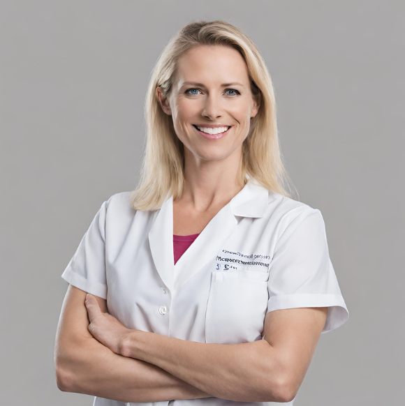

# Entendimento da Experiência do Usuário

## Personas

Para o projeto da AACD, foram criadas duas personas para o melhor entendimento dos usuários. A primeira persona é a criança que utiliza o tapete nas sessões, a segunda se trata da profissional que está atendendo a criança. 

### Persona 1

**Nome:** Lucas Teixeira Neves

**Informações Demográficas:** 5 anos, nasceu e cresceu em uma família humilde de São Mateus. Atualmente ele estuda em um colégio público de sua região chamado São João Evangelista.

**Background:** Lucas nasceu prematuro com 34 semanas. Com 1 ano a sua mãe percebeu que ele não conseguia andar. Após diversos exames, os médicos concluíram que ele possuía paralisia cerebral. Há 4 anos ele frequenta a AACD. 

**Dores, necessidades e desejos:** Lucas enfrenta desafios na expressão verbal, o que o motiva profundamente a buscar compreensão ao se comunicar.

**Cenários de interação com o sistema:** Durante suas consultas na clínica da AACD

*Interesses e hábitos relacionados ao sistema ou produto:* Lucas não tem acesso a dispositivos tecnológicos atualmente; em vez disso, terapeutas o auxiliam utilizando livros e brinquedos como ferramentas terapêuticas.

**Nível de letramento digital:** Baixa

### Persona 2

**Nome:** Marina Lopes Siqueira

**Formação:** Graduada em Psicologia com especialização em Terapia Ocupacional.

**Informações Demográficas:** 44 anos, nasceu em Campos Eliseos e se formou em terapia ocupacional na faculdade Cruzeiro do Sul.

**Background:** Marina é uma terapeuta ocupacional altamente qualificada, nascida em São Paulo e dedicada à sua profissão. Ela atualmente desempenha um papel crucial na AACD (Associação de Assistência à Criança Deficiente), onde coloca sua expertise em terapia ocupacional para melhorar a vida de pacientes com deficiências físicas e condições de saúde complexas. Sua abordagem personalizada e seu compromisso com o bem-estar de seus pacientes fazem dela uma profissional excepcional na área.

**Dores, necessidades e desejos:** Marina tem dificuldades de trabalhar por conta da baixa tecnologia dos itens utilizados nas consultas com as crianças 

**Cenários de interação:** Durante suas consultas na clínica da AACD

**Interesses e hábitos relacionados ao sistema ou produto:** Marina já teve contato com equipamentos de alta tecnologia em um evento recentemente. Porém, não possui um contato frequente com o sistema. 

**Nível de letramento digital:** Médio

### User Stories 

Como *terapeuta ocupacional*, gostaria de poder conectar meu tapete sensorial ao Greg Maker para personalizar a experiência sensorial com luzes e sons, proporcionando uma estimulação sensorial sob medida.

Como *terapeuta ocupacional*, desejo criar configurações específicas no Greg Maker para se alinharem com os objetivos terapêuticos do paciente, como promover a concentração, relaxamento ou desenvolver habilidades motoras.

Como *terapeuta ocupacional*, gostaria de ter a capacidade de programar o Greg Maker para oferecer uma experiência sensorial que seja segura, envolvente e apropriada para o desenvolvimento infantil.

Como *terapeuta ocupacional*, gostaria de usar o Greg Maker para controlar a intensidade e a duração da estimulação sensorial no tapete, para que eu possa adaptar a experiência às minhas necessidades e preferências específicas.

Como *terapeuta ocupacional*, desejo uma integração fácil entre o tapete sensorial e o Greg Maker, a fim de criar ambientes de aprendizagem mais envolventes e inclusivos para todos os alunos, independentemente de suas habilidades.

Como *terapeuta ocupacional*, desejo a capacidade de sincronizar as atividades de linguagem e comunicação com estímulos sensoriais gerados pelo Greg Maker, criando uma experiência terapêutica mais envolvente.

Como *criança com mobilidade reduzida*, gostaria de uma interface acessível no Greg Maker que me permita controlar o tapete sensorial de forma independente, mesmo que eu tenha limitações de destreza.

Como *desenvolvedor do projeto*, desejo a capacidade de criar aplicativos complementares para o Greg Maker que ampliem suas funcionalidades, proporcionando uma experiência sensorial ainda mais personalizada.

Como *criança com mobilidade reduzida*, gostaria de poder compartilhar minha experiência com o Greg Maker e o tapete sensorial com outras crianças em situações semelhantes, promovendo a comunidade e o apoio mútuo.
