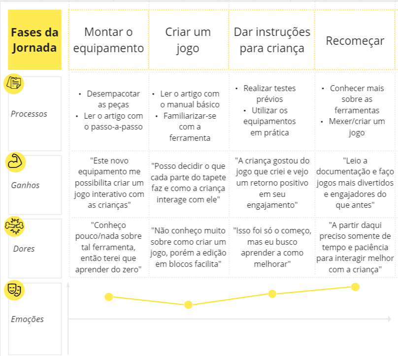

# Entendimento da Experiência do Usuário

## Mapa Jornada do Usuário

O Mapa da Jornada do Usuário é uma ferramenta importante para entender como o terapeuta e o paciente irão reagir ao uso do produto final. Nesta ferramenta são analisadas as etapas de aquisição, primeira experimentação e adaptação do(s) usuário(s) final(is), como as ações que o(s) usuários irão tomar, os ganhos atribuído a tais ações, possíveis dores que podem ser encontradas e qual são suas emoções naquele momento, positivas ou negativas.

Após discussões com professorees da faculdade e com a própria Terapeuta Ocupacional Ana Carolina (Líder de Terapia Infantil do Projeto), foi decidido não incluir a Jornada do Usuário do Paciente, pois cada paciente reage de uma forma diferente ao a sessões de terapia e é altamente dependente do terapeuta atribuido a ele.

### Jornada do Terapeuta

O Terapeuta Ocupacional é quem toma as deciões de tratamentos e sessões a serem realizadas com o paciente. Por isso, saber quais são suas emoções e tomadas de decisão conforme se adapta ao produto é crucial para o time. Com estas informações, podemos mapear quais funcionalidades possuem prioridade na hora da implementação e como tornar a experiência do terapeuta simples e flexível para diferentes tipos de pacientes, com baixa complexidade e fácil usabilidade do sistema como um todo.

Toda jornada possui pontos que sumarizam cada fase, os escolhidos foram:

1. Processos: É mapeando quais são as possíveis decisões que podem ser tomadas naquela fase pelo usuário analisado.
2. Ganhos: Quais são os ganhos positivos que o produto traz ao usuário quanto os processos mapeados acima são realizados.
3. Dores: Quais são as dores/desgates que são encontrados ao tomarem as decisões baseados nos processos citados acima.
4. Emoções: Um pequena gráfico que mostra onde se encontra a emoção do usuário em determinada fase. Este gráfico mostra se o usuário está feliz, neutro ou triste, e se há um declínio de emoções ou aumento gradativo delas.

A jornada proposta possui 4 fases:

1. Montar o Equipamento: A primeira parte consiste no terapeuta adquirindo o produto final. Neste pacote, há o tapete sensorial, Greg Maker e o compilador para criarem jogos adptados aos pacientes. Conforme a Líder de Terapia Infantil do Projeto, os próprios terapeutas terão que montar o equipamento nas paredes, por isto esta parte está inclusa no mapa. Ao captarmos as reações dos terapeutas com o produto em mãos, podemos identificar certas dúvidas em como o equipamento funciona como um todo, e preocupações de como irão aprender as funcionalidades inclusas no produto para utilizarem nas sessões terapeuticas. Suas reações são mistas por causa do primeiro contato.
   
2. Criar um Jogo: Ao montarem o equipamento e iniciarem o programa com a linguagem desenvolvida pelo time, agora será necessário criar um jogo que gere engajamento as crianças. Mesmo a linguagem sendo no code, não é facil aprender a utilizar uma nova ferramenta, levando em consideração do fato que poucos dos terapeutas possuem familiaridade com conceitos universais de lógica de programação. Esta etapa é especialmente delicada pois não se pode criar um jogo sem levar em consideração as necessidades únicas de cada indivíduo que o jogo será criado. Por exemplo, um som muito alto poderá desorientar e pertubar pacientes com autismo. As emoções não são tão positivas nesta fase.
3. Dar Instruções para a Criança: Após a criação e teste do jogo, o terapeuta introduz o jogo para a criança em uma sessão e analisa se o feedback será positivo ou negativo. Espera-se que com esforço e paciência na tomada de decisões e leitura dos manuais que estavam inclusos no pacote citado acima, o terapeuta presenciará um retorno positivo do paciente, e poderá adquirir informações importantes para o tratamento, como tempo de resposta entre ações e quantas tentativas houve até apertar um certo botão, por exemplo. As emoções são moderadamnete positivas com espaço para melhora.
4. Recomeçar: A partir desta fase, o terapeuta reconhece as funcionalidades do produto e visa estudar mais e testar novos jogos para os pacientes. Conforme mais sessões são realizadas com um determinado paciente, ele coletará dados sobre as sessões e poderá mostrar tais informações para os responsáveis de tal paciente, com o objetivo de diagnosticarem se houve uma melhora ou piorá de comportamento. As emoções dos terapeutas se mostram altas e positivas, e o terapeuta avalia que a ferramenta satisfaz necessidades de instrução com as crianças que antes se mostravam difíceis ou inviáveis, tanto por causa dos jogos utilizados serem de uso comercial e de entreterimento, tanto por não serem adaptados para os pacientes.
