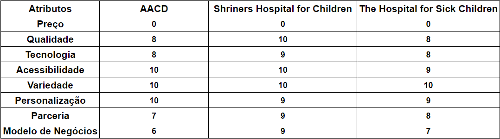
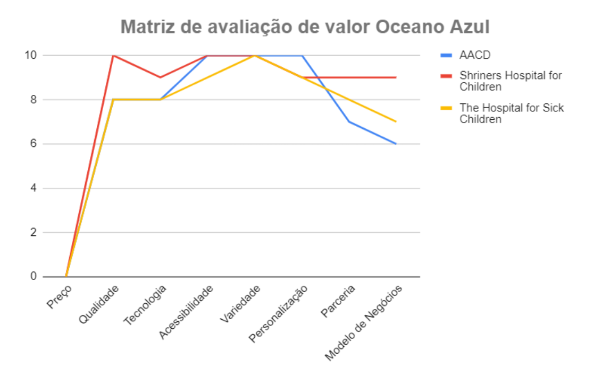
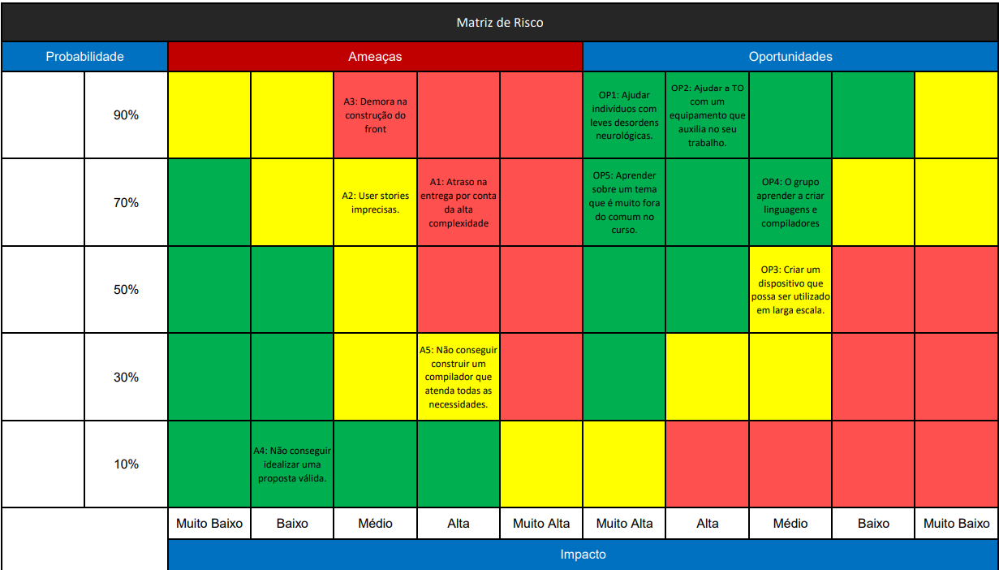

# Entendimento de negócio
A análise de negócios é uma disciplina fundamental que possibilita as organizações explorarem novas formas de aproveitar as tecnologias e extrair seus benefícios.
No contexto brasileiro, a AACD (Associação de Assistência à Criança Deficiente) emerge como um exemplo notável, desempenhando um papel crucial na vida de pacientes adultos e crianças com diversas necessidades especiais, como paralisia cerebral, acidente vascular cerebral e outras deficiências físicas e mentais. A abrangência dos serviços oferecidos pela AACD é notável, proporcionando a crianças identificadas precocemente com deficiências e àqueles que perderam funções cognitivas ou sensoriais ao longo da vida a oportunidade de desenvolvimento e uma vida cotidiana mais independente.

Com base nos diversos tipos de atendimentos oferecidos, este documento visa explorar uma análise de negócios específica: o uso da tecnologia para melhorar a terapia ocupacional oferecida pela AACD. Ao longo do texto, abordaremos uma série de tópicos relevantes, incluindo o canvas de proposta de valor, o modelo TAM (Total Addressable Market), SAM (Serviceable Addressable Market) e SOM (Serviceable Obtainable Market), a matriz de avaliação de Oceano Azul, a matriz de risco e a análise financeira do projeto. Essa análise tem como objetivo ampliar a eficácia dos serviços oferecidos pela AACD, melhorando o atendimento às crianças com paralisia cerebral e promovendo uma abordagem inovadora que pode ser aplicada em outras áreas de atendimento.

## Canvas de Proposta de Valor

## TAM, SAM e SOM

## Matriz de Avaliação de Oceano Azul
A matriz de Oceano Azul é usada para avaliar o impacto das empresas que atuam no mesmo setor da AACD, nesse caso, na interseção da terapia ocupacional e tecnologia. Nesse contexto, escolhemos cuidadosamente três instituições líderes nesse nicho, a fim de analisar seu desempenho e identificar oportunidades de diferenciação.

A matriz de avaliação de Oceano Azul representa uma métrica poderosa que nos permite comparar essas instituições em oito parâmetros-chave. Cada parâmetro é classificado em uma escala de 0 a 10, em que 0 representa o desempenho mais fraco e 10 o desempenho excepcional. Além disso, examinaremos os motivos por trás de cada pontuação, proporcionando uma visão aprofundada de como cada instituição se destaca em áreas específicas.

Através dessa análise inovadora, buscamos identificar oportunidades para criar um 'oceano azul', ou seja, um espaço de mercado inexplorado e de baixa competição, no qual a AACD e outras instituições possam prosperar. Vamos explorar as descobertas obtidas por meio desta matriz, iluminando caminhos para aprimorar os serviços de terapia ocupacional e tecnologia oferecidos a crianças com paralisia cerebral e outras necessidades especiais.

Para entendermos melhor a matriz de avaliação de Oceano Azul, vamos analisar os oito parâmetros-chave que compõem essa métrica. Esses parâmetros são divididos em quatro categorias principais: preço, qualidade, tecnologia e acessibilidade. Cada categoria é composta por dois parâmetros, que será apresentado nas figuras 1 e 2 e descritos abaixo.

Figura 1: Parâmetros e notas da matriz de avaliação de Oceano Azul

Figura 2: Gráfico de comparação de parâmetros da matriz de avaliação de Oceano Azul

### Preço
O atributo de preços pode ser representado pelo custo de tratamento de um paciente, que seria pago diretamente a instituição. Como todas as instituições do comparativo atuam com insumos públicos e/ou privados, a nota de todas elas foi 0, uma vez que não há custos diretos para o paciente. Neste atributo, foi avaliado que não há necessidade em aumentar, reduzir, eliminar ou criar um novo atributo, mas de manter o atributo atual.

### Qualidade
O atributo de qualidade é representado pela qualidade do atendimento, dos equipamentos e recursos disponíveis e dos serviços prestados. Neste aspecto, o Shriners se destaca, uma vez que tem o seu investimento captado de diversas fontes, pessoas e empresas, trazendo equipamentos de ponta e profissionais altamente qualificados. A AACD e o Hospital for Sick Children possuem uma nota de 8, enquanto o Shriners possui uma nota de 10. Neste atributo, foi avaliado que há necessidade em aumentar o atributo atual na AACD, uma vez que o maior capital ainda é o do governo e isso pode limitar a operação e alguns tratamentos quanto dito sobre recursos e a qualidade deles, deixando um peso maior para os terapeutas suprirem para que a avaliação da instituição seja boa e desejável de ser mantida.

### Tecnologia
O atributo de tecnologia se refere aos recursos tecnológicos oferecidos dentro de cada instituição, sob perspectiva de qualidade e variedade disponível. Neste atributo, as instituições mencionadas estão bem equiparadas, pois oferecem maquinário e equipamentos necessários para as tarefas tradicionais dos tratamentos e oferecem recursos alternativos para uma tratamento que precisa de atividades diferentes. Por conta disto, o Shriners recebeu nota 9 e a AACD e o Hospital for Sick Children receberam nota 8 e o ideal para este atributo é visar o aumento da tecnologia nos recursos e equipamentos oferecidos.

### Acessibilidade
O atributo de acessibilidade foi avaliado sobre a perspectiva de diversidade de meios de chegada ao instituto e a praticidade de acesso. Neste atributo, o Shriners se destaca em quantidade e dispersão, pois possui uma rede de 22 hospitais espalhados pelos Estados Unidos, Canadá e México, enquanto a AACD possui 9 unidades espalhadas pelo Brasil e o Hospital for Sick Children possui apenas uma unidade em Toronto. Ainda assim, com base no Google Maps, todas as instituições dos 3 nomes mencionados possuem uma boa localização para transportes públicos e estacionamento para transportes privados. Por conta disto, o Shriners e a AACD receberam nota 10, por quantidade de unidades e o Hospital for Sick Children recebeu nota 9, por ter uma unidade só e o transporte público parar pouco distante da instituição. Embora as notas sejam altas, o ideal para este atributo é visar melhorar a acessibilidade, seja com mais unidades ou com uma melhor localização para o transporte público, aumentando a nota ou mantendo-a em 10.

### Variedade
O atributo de variedade foi avaliado sob a perspectiva de quantidade de atendimentos na instituição. Neste atributo, todas as instituições oferecem uma gama muito similar de atendimentos, com foco em terapia ocupacional, fisioterapia, fonoaudiologia, psicologia, nutrição e terapia da dor. Por conta disto, o Shriners, a AACD e o Hospital for Sick Children receberam nota 10. Para este atributo, o ideal é mantê-lo, já que estão bem desenvolvidos neste aspecto.

### Personalização
O atributo de personalização foi avaliado sob a perspectiva de quanto os atendimentos terapêuticos podem mudar de acordo com a necessidade individual de cada paciente. Neste atributo, a AACD se destaca por personalizar o atendimento para cada paciente e gerar relatórios ao final de cada sessão e um relatório de desenvolvimento trimestral para uma análise de evolução de cada paciente, enquanto o Shriners e o Sick Kids não possuem o segundo modelo de relatório. Por conta disto, a AACD recebeu nota 10, enquanto o Shriners e o Sick Kids receberam nota 9. Embora todas as instituições tem uma nota muito alta, o objetivo ideal é continuar desenvolvendo este atributo para aumentar e manter sempre com uma nota muito alta com o desenvolvimento de novas tecnologias e de descobertas sobre as áreas de atendimento de cada instituição.

### Parceria
O atributo de parceria foi avaliado com base na diversidade de parceiros que podem e investem em cada instituição. Neste atributo, o Shriners leva uma valiosa vantagem, pois é uma instituição filantrópica que recebe investimentos de todas as direções (pública, privada e governamental), tendo a maior fonte, o investimento privado. A AACD e o Sick Kids atuam com investimento majoritário governamental, sendo relativamente limitado ao que o governo pode oferecer. Por mais que tenham investimentos privados, eles não suprem as necessidades financeiras que poderiam ser cobertas por um insumo ideal do investidor majoritário. Por conta disto, o Shriners recebeu nota 9, enquanto a AACD recebeu nota 7 e o Sick Kids receberam nota 8. Neste aspecto, o ideal seria aumentar as notas de todas as instituições, mas é importante entender que não é por conta própria que elas tenham essas necessidades, mas por motivos externos.

### Modelo de Negócio
O atributo de modelo de negócios foi avaliado com base nas fontes de financiamento e nos fluxos de receita. A AACD e o Sick Kids atuam majoritariamente com capital proveniente do pagamento de impostos da população e pode atender também através de convênios e/ou seguros saúde. O Shriners atua com capital proveniente de doações de pessoas e empresas, além de receber investimentos governamentais e de convênios e/ou seguros saúde. Por conta da maior abrangência em seu modelo de negócios, o Shrines leva vantagem neste atributo da comparação e consequentemente, a maior nota, sendo avaliado com nota 9, enquanto a AACD recebeu nota 6, uma vez que seu investimento primário é controlado e relativamente baixo para a demanda de ação (em comparação interna de quando a instituição era considerada "portas abertas") e o Sick Kids recebeu nota 7, pois seu maior investimento não é diretamente financeiro, mas em alunos estudantes da universidade de Toronto que fazem estágios e/ou residência na instituição e colaboram com o tratamento dos pacientes. Neste aspecto, o ideal seria aumentar as notas de todas as instituições, mas assim como o atributo de parceria, é importante entender que não é por conta própria que elas tenham essas necessidades, mas por motivos externos.

## Matriz de Risco

 

### Descrição da matriz de risco

**Ameaça 1: Atraso na entrega por conta da alta complexidade** - Dada a complexidade envolvida na criação de compiladores, estamos antecipando a ocorrência de atrasos e já estamos trabalhando para identificar e resolver possíveis erros no planejamento, tornando o cumprimento dos prazos uma prioridade.

**Ameça 2: User stories imprecisas** - Após conversas com o professor Chico e a TO, ficou evidente que estamos enfrentando desafios em entender completamente as necessidades das personas envolvidas. Embora estejamos abordando o projeto com empatia, reconhecemos que essa tarefa não será simples.

**Ameaça 3: Demora na construção do front** - Não temos especialistas em desenvolvimento de frontend em nosso grupo, o que torna a construção dessa parte do projeto um desafio. Estamos organizando nossos esforços para garantir a melhor qualidade possível na criação do frontend.

**Ameaça 4: Não conseguir idealizar uma proposta válida** - Neste módulo, nosso grupo teve dificuldade em criar uma proposta de projeto que se enquadrasse no escopo. Isso nos faz conscientes de que podem existir falhas não previstas em nosso projeto.

**Ameaça 5: Não conseguir construir um compilador que atenda todas as necessidades** - Dado o caráter complexo do tema e a falta de experiência prévia no grupo, estamos cientes de que a criação de um compilador que atenda a todas as necessidades representará um desafio significativo. O sucesso nessa tarefa é crucial, pois o compilador é uma parte essencial da aplicação.

**Oportunidade 1: Ajudar indivíduos com leves desordens neurológicas** - Todos no grupo veem este projeto como uma oportunidade valiosa para fazer a diferença na vida das pessoas, e estamos empenhados em fornecer qualquer ajuda possível para melhorar a qualidade de vida daqueles afetados.

**Oportunidade 2: Ajudar a TO com um equipamento que auxilia no seu trabalho** - Além de desenvolver o software, estamos comprometidos em entregar o hardware (o tapete) com excelência. Nossa meta é fornecer um projeto completo que atenda às expectativas tanto em termos de software quanto de hardware.

**Oportunidade 3: Criar um dispositivo que possa ser utilizado em larga escala** - Entregar um projeto viável para produção em larga escala é uma conquista significativa que nossa equipe deseja alcançar. Isso nos permitirá ajudar um grande número de pessoas, tornando o projeto ainda mais valioso.

**Oportunidade 4: O grupo aprender a criar linguagens e compiladores** - Encaramos o desafio de construir uma linguagem e trabalhar com compiladores como uma oportunidade única de aprender conceitos complexos. Aplicar esses conhecimentos em um projeto relevante é uma parte fundamental de nossa abordagem.

**Oportunidade 5: Aprender sobre um tema que é muito fora do comum no curso** - Uma das maiores oportunidades deste projeto é o aprendizado em um campo que geralmente não é abordado em cursos de ciência da computação. Estamos entusiasmados em aprender sobre inclusão e expandir nossos horizontes ao participar ativamente de um projeto que aborda realidades diferentes da nossa.

## Análise Financeira

**Visão Geral do Projeto:**

O projeto consiste em fornecer um "Tapete Sensorial Ligado ao Greg Maker" para a AACD, com o objetivo de aprimorar a qualidade de vida, autonomia e independência de crianças, adolescentes e adultos com leves desordens neurológicas. O tapete sensorial foi projetado para estimular sensações táteis e proprioceptivas, melhorando as respostas motoras funcionais e auxiliando nas atividades de vida diária (AVD) dos pacientes. Além disso, o tapete proporciona experiências relacionadas às funções cognitivas, como discriminação figura-fundo, constância de formas, memória visual, relações espaciais, discriminação visual e reconhecimento de cores e formas.

**Método de Análise:**

Construímos dois cenários: um que não inclui os custos dos desenvolvedores do projeto, o que corresponde a uma parceria com a Inteli. No entanto, consideramos relevante apresentar uma visão em que incluímos esses custos de desenvolvimento para fins de comparação, como se o projeto não tivesse sido realizado em parceria com uma organização sem fins lucrativos.

**Cenário 1: Sem Custos de Desenvolvimento**

Neste cenário, supomos que não há custos de desenvolvimento, e nossos únicos custos incluem a aquisição do Greg Maker e do tapete sensorial.

Tabela de Custos Anuais (Sem Desenvolvimento):

| Despesa                | Custo Anual   |
|------------------------|---------------|
| Greg Maker             | R$ 500,00      |
| Tapete Sensorial       | R$ 450,00      |
| **Custo Total**        | **R$ 950,00**  |

**Cenário 2: Com Custos de Desenvolvimento (10 Semanas de Trabalho)**

Neste cenário, consideramos o custo dos desenvolvedores com base em 10 semanas de trabalho. Supomos que o salário médio mensal por desenvolvedor júnior seja de R$ 5.000,00.

Cálculo do Custo de Desenvolvimento (10 Semanas):

8 desenvolvedores * (R$ 5.000,00/mês / 4 semanas) * 10 semanas = R$ 100.000,00

Tabela de Custos Anuais (Com Desenvolvimento):

| Despesa                | Custo Anual   |
|------------------------|---------------|
| Desenvolvimento (Custo dos Desenvolvedores) | R$ 100.000,00  |
| Greg Maker             | R$ 500,00      |
| Tapete Sensorial       | R$ 450,00      |
| **Custo Total**        | **R$ 100.950,00** |

**Considerações Adicionais:**

* É importante destacar que esta análise é uma estimativa e que o projeto é uma parceria entre a AACD e o Inteli. Portanto, alguns custos podem variar caso o projeto seja reproduzido em outra situação.
  
* A análise foi feita com base em estimativas então pode haver alterações nos valores fornecidos.